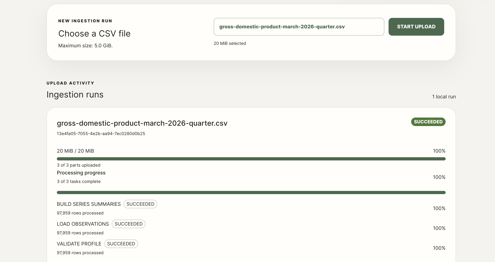
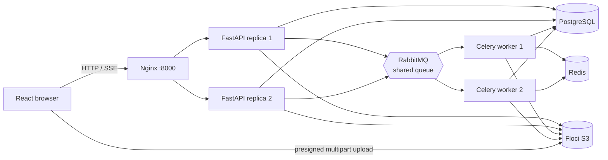

# Scalable Data Ingestion

A local CSV ingestion project using React with Material UI, FastAPI, PostgreSQL, Floci S3, RabbitMQ, Celery, and Redis.

The current implementation creates a durable ingestion run, splits a CSV into 8 MiB parts in the browser, uploads up to three parts concurrently, and finalizes the multipart upload directly with Floci. FastAPI receives metadata and ETags only; it never receives CSV bytes.



## Run locally

Start the backend services:

```sh
cd backend
cp .env.example .env  # optional
docker compose up --build
```

Start React in another terminal:

```sh
cd frontend
npm install
npm start
```

Open `http://localhost:3000`. The API is available at `http://localhost:8000`, and Floci at `http://localhost:4566`.

## Architecture



Docker Compose runs two FastAPI replicas behind Nginx and two Celery workers consuming from the same RabbitMQ broker and queue. Nginx is the only service that publishes the API port (`API_PORT`, default `8000`).

The browser validates the selected CSV and configured size limit, creates an ingestion run, requests presigned part URLs in bounded batches, records each returned `ETag`, and offers individual retries for failed parts. It then submits the ordered manifest directly to Floci through a signed completion request. FastAPI verifies the final key, size, and ETag with `HeadObject` before recording upload confirmation. Celery independently validates, loads, and summarizes the CSV from S3, writing restart-safe checkpoints and result rows to PostgreSQL. Upload state is keyed by run UUID, so the same filename can be uploaded independently.

## Configuration

Backend configuration is documented in `backend/.env.example`. Relevant frontend build settings are optional:

```sh
REACT_APP_API_BASE_URL=http://localhost:8000
REACT_APP_MAX_UPLOAD_SIZE_BYTES=5368709120
```

The frontend maximum should match backend `MAX_UPLOAD_SIZE_BYTES`.
Workers checkpoint every `WORKER_CHECKPOINT_ROWS` records (default `1000`) and retry transient S3/database faults up to `WORKER_MAX_RETRIES` times (default `3`).

## Useful commands

```sh
# Backend tests
cd backend
docker compose run --rm --no-deps api pytest -q

# Floci bucket, CORS, and multipart-completion smoke test (with Floci running)
docker compose run --rm --no-deps floci-init python -m app.scripts.smoke_test_s3

# Republish durable queued tasks left without a Celery ID (for example after an API stop)
docker compose run --rm --no-deps api python -m app.scripts.reconcile_queued_tasks

# Frontend tests and production build
cd ../frontend
CI=true npm test -- --runInBand
npm run build
```

Database migrations run automatically before the API and worker start. After changing SQLAlchemy models, generate and apply a migration from `backend/`:

```sh
alembic revision --autogenerate -m "describe change"
alembic upgrade head
```

## Upload endpoints

- `POST /api/v1/ingestion-runs` — validate metadata and create a unique multipart upload.
- `POST /api/v1/ingestion-runs/{run_id}/part-urls` — issue a bounded set of presigned part URLs.
- `POST /api/v1/ingestion-runs/{run_id}/completion-request` — validate the ordered ETag manifest and sign the S3 completion request.
- `POST /api/v1/ingestion-runs/{run_id}/confirm-upload` — verify the finalized object, create the three durable processing tasks, and queue them in Celery.
- `GET /api/v1/ingestion-runs/{run_id}` — retrieve the durable processing snapshot and result summaries.
- `GET /api/v1/ingestion-runs/{run_id}/events` — receive the snapshot first, then live committed processing progress over SSE.
- `POST /api/v1/ingestion-runs/{run_id}/abort` — discard an unfinished multipart upload.
